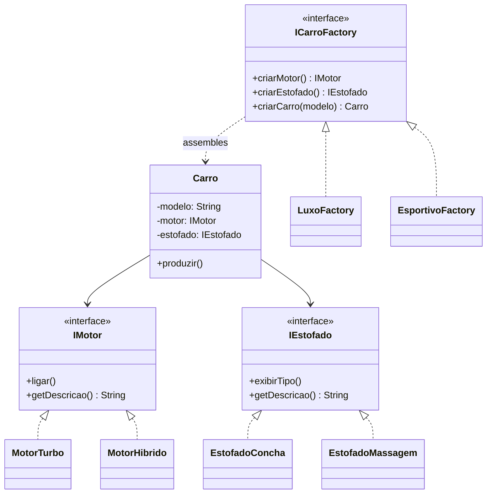

# ☕ Java Design Patterns — Abstract Factory


A Java implementation of the **Abstract Factory Design Pattern**, built to practice Object-Oriented Programming, software design principles, and the creation of flexible, testable class hierarchies.

This project started as a study exercise and is being actively evolved — see the [Roadmap](#-roadmap) below for what's already done and what's coming next.

---

## 🎯 About the Project

The project simulates a car manufacturing system where different factories produce families of related, compatible components — without the client code ever depending on a concrete implementation.

Two product families are available today:

| Family | Engine | Upholstery |
|---|---|---|
| **Luxo** | Motor Híbrido V6 | Couro Premium com massagem |
| **Esportivo** | Motor Turbo 2.0 | Banco Concha Reclinável |

Each factory guarantees that its components are always compatible with each other — you can never end up with a sport upholstery paired with a luxury engine by mistake. That consistency guarantee is the whole point of the pattern.

---

## 🏭 Design Pattern

### Abstract Factory

The Abstract Factory Pattern provides an interface for creating families of related objects without specifying their concrete classes. Here, `ICarroFactory` is the abstract factory; `LuxoFactory` and `EsportivoFactory` are the concrete factories that decide *which* components get created and assembled into a `Carro`.



`Carro` is the **composite product**: the factory doesn't just hand out loose parts, it assembles a complete, immutable, ready-to-use object — the core responsibility an Abstract Factory is supposed to have.

---

## 🛠️ Technologies

- Java 17
- Object-Oriented Programming (interfaces, abstraction, polymorphism)
- Design Patterns (Abstract Factory)

---

## 📂 Project Structure

```
src
└── br
    └── com
        └── tcoimb
            ICarroFactory.java     — abstract factory
            IMotor.java            — abstract product
            IEstofado.java         — abstract product
            Carro.java             — composite product
            LuxoFactory.java       — concrete factory
            EsportivoFactory.java  — concrete factory
            MotorTurbo.java        — concrete product
            MotorHibrido.java      — concrete product
            EstofadoMassagem.java  — concrete product
            EstofadoConcha.java    — concrete product
            Main.java              — client / demo
```

---

## ▶️ How to Run

```bash
git clone https://github.com/Tatidev78/java-design-patterns.git
cd java-design-patterns
javac -d out src/br/com/tcoimb/*.java
java -cp out br.com.tcoimb.Main
```

Or open the folder in IntelliJ IDEA, Eclipse, or VS Code with the Java extension pack and run `Main.java` directly.

**Expected output:**
```
Produzindo Linha Luxo
Ligando Motor Híbrido! 🤫
Material: Couro Premium com função de massagem.
Linha Luxo [Motor Híbrido V6 | Couro Premium com massagem]

Produzindo Linha Esportivo
Ligando Motor Turbo
Material: Banco Concha Reclinável (Máxima aderência para pistas).
Linha Esportivo [Motor Turbo 2.0 | Banco Concha Reclinável]
```

---

## 🗺️ Roadmap

This project is a live learning exercise — the checklist below is intentionally public so progress is visible over time.

- [x] Abstract Factory pattern with two product families
- [x] Composite product (`Carro`) assembled by the factory
- [x] Products expose testable data (`getDescricao()`), not just console output
- [ ] Migrate to Maven, with a proper `src/main/java` / `src/test/java` layout
- [ ] Unit tests with JUnit 5
- [ ] A second pattern combined with Abstract Factory (Builder or Strategy)
- [ ] Modern Java features (records, enums with behavior, `Optional`)
- [ ] Continuous Integration with GitHub Actions
- [ ] Javadoc on public interfaces

---

## 💡 Concepts Practiced

- Interfaces and abstraction
- Factory design pattern (Abstract Factory)
- Composition over inheritance
- Designing for testability (separating side effects from data)
- Code organization and package structure

---

## 👩‍💻 Author

**Tatiana Coimbra**
GitHub: [github.com/Tatidev78](https://github.com/Tatidev78)
LinkedIn: [linkedin.com/in/tatiana-coimbra-dev](https://www.linkedin.com/in/tatiana-coimbra-dev/)

---

## 📄 License

This project was developed for educational purposes.
